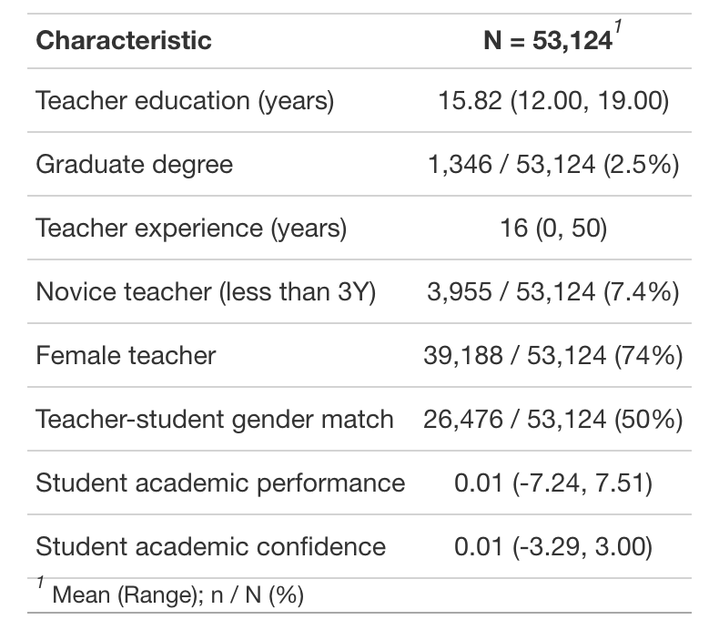
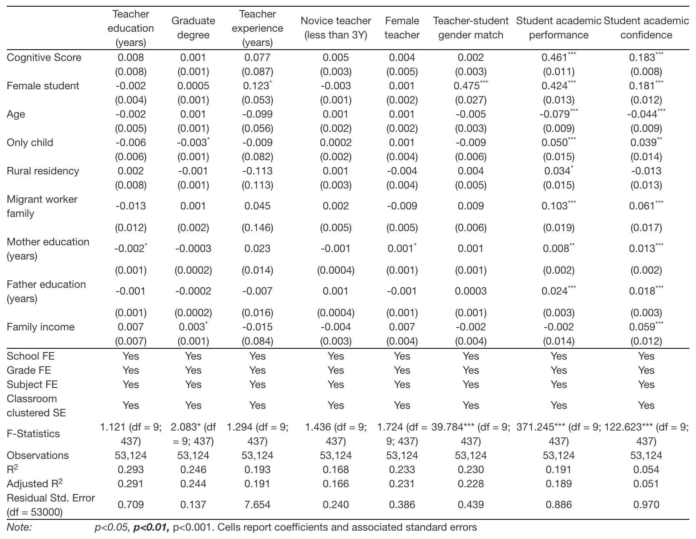
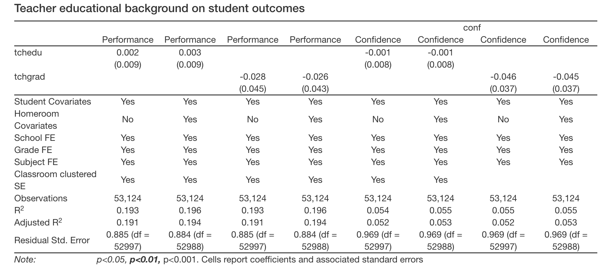
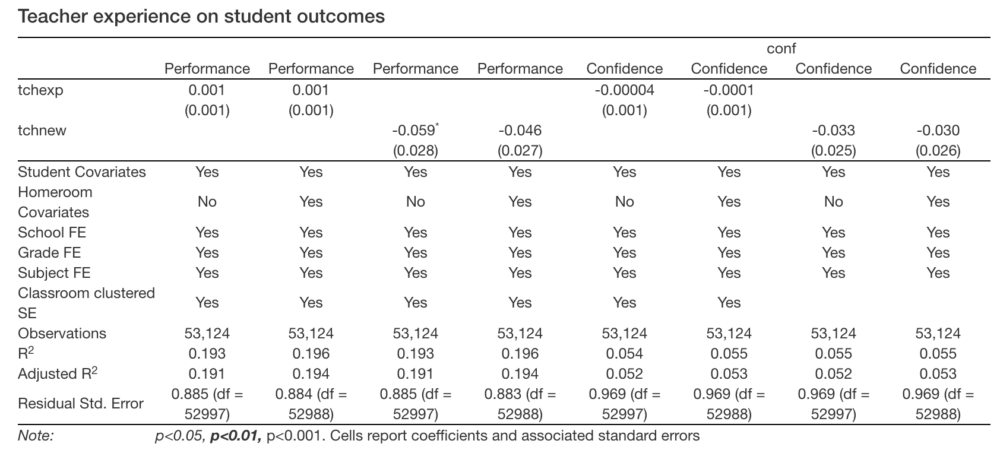
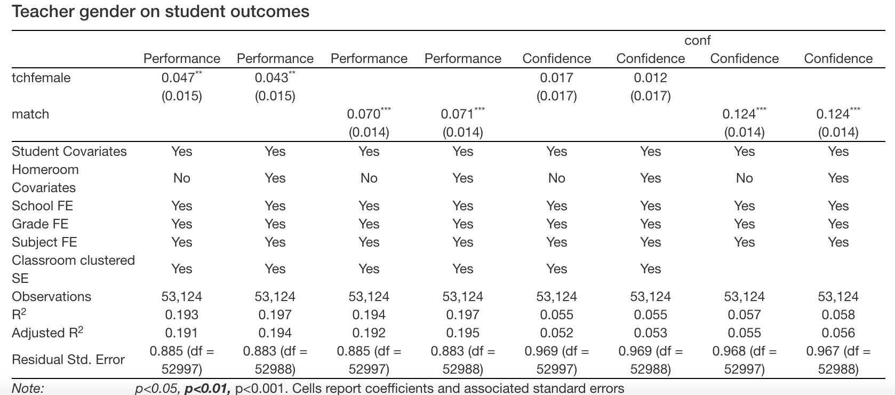

```{r setup, include=FALSE}
options(htmltools.dir.version = FALSE)
```

```{r xaringan-themer, include=FALSE, warning=FALSE}
library(xaringanthemer)
style_mono_light(base_color = "#23395b",
                 base_font_size = "20px",
                 header_h1_font_size = "2.10rem",
                 header_h2_font_size = "1.10rem")
```

# Research Significance

#### Teacher quality matters 

 - An extensive research body exploits within-teacher variation over time and shows that teacher quality has substantial impacts on student outcomes (e.g., Aaronson et al., 2007; Chetty et al., 2014; Clotfelter et al., 2007; Harris & Sass, 2011; Rockoff, 2004)
   - teacher quality is measured by teacher's value-added to student achievement
   - Rockoff (2004) reports that a 1 standard deviation difference in the quality of a student’s teacher (based on the distribution of teacher quality that emerges from the teacher fixed effects in his model) generates a 0.1 standard deviation difference in reading and math scores.


---
# Research Significance (cont'd)

#### Teacher background characteristics (TBCs) are widely used in teacher recruitment/evaluation/compensation

 - From past to future, all over the world
 - Advantages include:
   - Computationally cheaper than value-added measures
   - Practically easier than student/parent/peer/principal rating and observations
   - Easy to measure and minimum measurement error
 
---
# Previous research: preparation and educational background

 - Teacher certification/licensure and teacher value-added 
   - Insignificant relationship (Aaronson et al., 2007;)
   - Positive relationship (Clotfelter et al., 2007;)
 
 - Teacher earned degree and teacher value-added 
   - Insignificant relationship (Aaronson et al., 2007; Clotfelter et al., 2007; Harris & Sass, 2011; Wayne & Youngs, 2003)
   - Graduate degree is found to be correlated with teacher quality ()

---
# Previous research: teaching experience

 - Positive relationship between years of teaching and value-added (Clotfelter et al., 2007; Kane et al., 2008; Ladd & Sorensen, 2017; Rockoff, 2004)
   - students taught by novice teachers lag behind in terms of academic performance (Hill et al., 2019)
 
 - Returns to teaching are larger in early years on job (Chetty et al., 2014; Clotfelter et al., 2007; Harris & Sass, 2011; Kane et al., 2008; Papay & Kraft, 2015)
 
 - Average returns to teacher experience are larger for mathematics than reading (Harris & Sass, 2011)
 
 - A small research body found null effects of teacher experience on student outcomes (Aaronson et al., 2007)
 
---
# Previous research: teacher gender and gender match

 - No causal evidence on teacher gender effect in general
   - the observed difference in effectiveness between male and female teachers is driven by teacher-student gender match (Aaronson et al., 2007)
 
 - Researchers have identified causal evidence on the effects of gender match on student learning (e.g., Dee, 2007)

---
# Current research

#### TBCs of interest (using variable names going forward now; change later)

 - Educational background 
   - years of education (tchedu)
   - graduate degree - master's and above (tchgrad)
 - Teaching experience
   - years of teaching (tchexp)
   - novice teacher (tchnew)
 - Teacher gender
   - teacher gender (tchfemale)
   - teacher-student gender match 

#### Outcomes of interest

 - Student academic performance (score)
 - Student academic confidence (conf)
 
---
# Research Questions 

What teacher background characteristics causally impact student academic performance and attitude?

What are the magnitudes of these effects?

---
# Background: Population of interest

Chinese middle school (grades 7-9) students and their core content teachers teaching:

 - Chinese (Chinese language arts), English (foreign language), and math (general mathematics)
 
 - which are the only core subjects that are mandate across all middle schools in the nation AND require three years of learning 

---
# Background: Random teacher-student assignment in Chinese middle schools

Policy background (2006 Compulsory Education Law banned the sorting of students to teachers based on performance at elementary and middle school level)

 - to comply, schools create either random or stratified homerooms of students and teacher groups upon students’ entry to school, then randomly assign a teacher group to each student homeroom
 
 - students in the same homeroom share a homeroom schedule and teachers rotate to the homeroom to teach
 
 - to further ensure equal education opportunity, students typically stay in the assigned homerooms and teachers follow them rising to higher grades throughout all years at the same school
 
---
# Data 

We draw a large, nationally representative sample from the publicly available, baseline (2013/14) data of China Education Panel Survey (CEPS). Unit of analysis is school-grade-subject-student, hence, data is clustered in nature. Levels of clusters:

 - School level
   - CEPS randomly selected 112 schools from the nation but we restricted our sample schools to 85 public schools that reported that they randomly assigned teachers to students upon students' entry to middle school
 
 - Homeroom/teacher level
   - Within each school, CEPS randomly selected two homerooms from grade 7 and another two from grade 9
   
 - Students level
   - Within each homeroom, CEPS surveyed all students, their parents, and core content teachers

---


---
# Research design A: identification strategy
#### Assuming random assignment of teachers to students and identify average treatment effects/ATE

 - Evidence of random assignment: covariates balance in the data (next slide)

---


---
# Research design A: estimation strategy
 
 - Estimate each TBC on student outcomes separately
 
 - Estimate a linear model by OLS (under random assignment assumption)
   - control for school, grade, and subject fixed-effects and cluster standard errors at homeroom level
   - maximize the estimation precision by accounting for a rich set of student-level covariates
     - then add homeroom-level covariates as robustness check
     - a unique covariate, cognitive test score (use cubic polynomial function)

---
# Research design B - identification strategy
#### Relax random assignment assumption, using generalized random forests (Athey et al., 2019) to identify conditional average treatment effects/CATE

 - Lots to learn/don't know if works
 
 - Resources:
   - https://www.science.org/doi/epdf/10.1126/science.aal4321
   - https://grf-labs.github.io/grf/
   - https://towardsdatascience.com/causal-machine-learning-for-econometrics-causal-forests-5ab3aec825a7

---
# Results part 1



---
# Results part 2



---
# Results part 3




