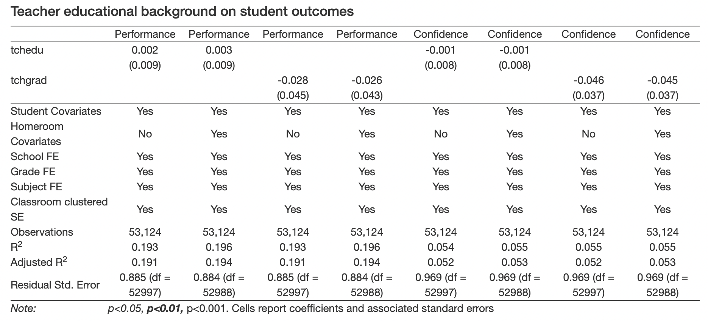
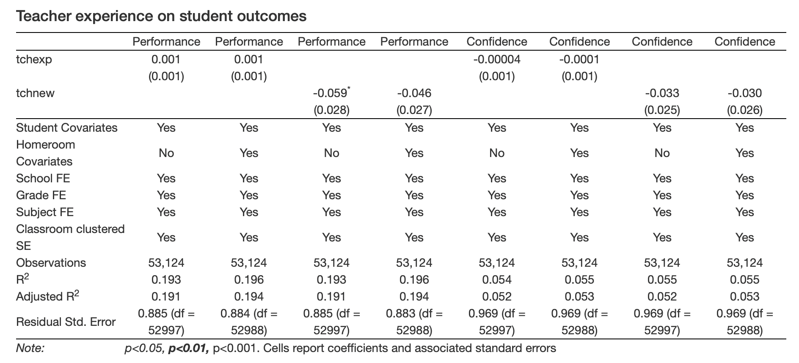
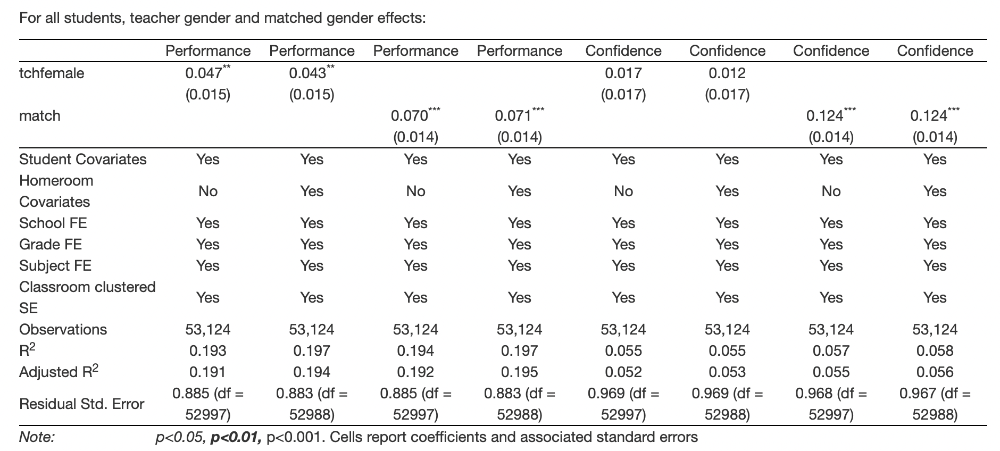

```{r setup, include=FALSE}
options(htmltools.dir.version = FALSE)
```

```{r xaringan-themer, include=FALSE, warning=FALSE}
library(xaringanthemer)
style_mono_light(base_color = "#23395b",
                 base_font_size = "20px",
                 header_h1_font_size = "2.10rem",
                 header_h2_font_size = "1.10rem")
```


#### (I plan to have a co-author, Anwesha, to work with me on the propensity score matching method. The current work is all mine. I am aware that I need to file out a form to disclose this information in my dissertation.)

---
# Research Significance

#### Teacher quality matters 

 - An extensive research body exploits within-teacher variation over time and shows that teacher quality has substantial impacts on student outcomes (e.g., Aaronson et al., 2007; Chetty et al., 2014; Clotfelter et al., 2007; Harris & Sass, 2011; Rockoff, 2004)
 
   - teacher quality is measured by teacher's value-added to student achievement in this line of research 
   
   - Rockoff (2004) reports that a 1 standard deviation difference in the quality of a student’s teacher (based on the distribution of teacher quality that emerges from the teacher fixed effects in his model) generates a 0.1 standard deviation difference in reading and math scores

---
# Research Significance (cont'd)

#### Teacher background characteristics (TBCs) are widely used in teacher recruitment/evaluation/compensation

 - From past to future, all over the world
 
 - Advantages include:
   - Computationally cheaper than value-added measures
   - Practically easier than student/parent/peer/principal rating and observations
   - Easy to measure and minimum measurement error
 
---
# Previous research: preparation and educational background

 - Teacher certification/licensure and teacher value-added 
   - Insignificant relationship (Aaronson et al., 2007;)
   - Positive relationship (Clotfelter et al., 2007;)
 
 - Teacher earned degree and teacher value-added 
   - Insignificant relationship (Aaronson et al., 2007; Clotfelter et al., 2007; Harris & Sass, 2011; Wayne & Youngs, 2003)
   - Graduate degree is found to be correlated with teacher value-added (Guarino et al., 2013)

---
# Previous research: teaching experience

 - Positive relationship between years of teaching and value-added (Clotfelter et al., 2007; Kane et al., 2008; Ladd & Sorensen, 2017; Rockoff, 2004)
   - students taught by novice teachers lag behind in terms of academic performance (Hill et al., 2019)
 
 - Returns to teaching are larger in early years on job (Chetty et al., 2014; Clotfelter et al., 2007; Harris & Sass, 2011; Kane et al., 2008; Papay & Kraft, 2015)
 
 - Average returns to teacher experience are larger for mathematics than reading (Harris & Sass, 2011)
 
 - A small research body found null effects of teacher experience on student outcomes (Aaronson et al., 2007)
 
---
# Previous research: teacher gender and gender match

 - No causal evidence on universal teacher gender effect; the observed difference in effectiveness between male and female teachers is driven by teacher-student gender match (Aaronson et al., 2007)
 
 - Some argue that no universal teacher–student gender match effect either (Cho, 2012; Winter et al., 2013) 
 
 - Some studies find evidence on the effects of gender match on student learning for both girls and boys (Dee, 2007; Sansone, 2017) 
   - but some emphasize that gender match only impacts girls, not boys (Gong et al., 2018; Lim and Meer, 2017; Xu and Li, 2018)

---
# Current research

#### TBCs of interest (using variable names going forward now; change later)

 - Educational background 
   - years of education (tchedu)
   - graduate degree - master's and above (tchgrad)
 - Teaching experience
   - years of teaching (tchexp)
   - novice teacher (tchnew)
 - Teacher gender
   - teacher gender (tchfemale)
   - teacher-student gender match (match)

#### Outcomes of interest

 - Student academic performance (score)
 - Student academic confidence (conf)
 
---
# Research Questions 

What teacher background characteristics causally impact student academic performance and attitude?

What are the magnitudes of these effects?

---
# Background: Population of interest

Chinese middle school (grades 7-9) students and their core content teachers teaching:

 - Chinese (Chinese language arts), English (foreign language), and math (general mathematics)
 
 - which are the only core subjects that are mandate across all middle schools in the nation AND require three years of learning 

---
# Background: Random teacher-student assignment in Chinese middle schools

Policy background (2006 Compulsory Education Law banned the sorting of students to teachers based on performance at elementary and middle school level)

 - to comply, schools create either random or stratified homerooms of students and teacher groups upon students’ entry to school, then randomly assign a teacher group to each student homeroom
 
 - students in the same homeroom share a homeroom schedule and teachers rotate to the homeroom to teach
 
 - to further ensure equal education opportunity, students typically stay in the assigned homerooms and teachers follow them rising to higher grades throughout all years at the same school
 
---
# Data 

We draw a large, nationally representative sample from the publicly available, baseline (2013/14) data of China Education Panel Survey (CEPS). Unit of analysis is student-by-subject observation and data is clustered in nature. Levels of clusters:

 - School level
   - CEPS randomly selected 112 schools from the nation using a Probability Proportional to Size (PPS) strategy
 - Homeroom/teacher level
   - Within each school, CEPS randomly selected two homerooms from grade 7 and another two from grade 9
 - Students level
   - Within each homeroom, CEPS surveyed all students, their parents, and core content teachers
   - Each student has three subject scores available and can be matched with three subject teachers (small missingness)

---
#### Table 1. Analytic sample descriptive statistics


---
# Research design A: identification strategy
#### Independence assumption (suppose we have random assignment of teachers to students)

 - Evidence of random assignment: covariates balance in the data (next slide)
 
 - Takeaway from balance check: the analytic sample is largely balanced against all six predictor variables with two exceptions
 
   - there is evidence of small student sorting to teachers with a graduate degree
   - teacher gender is exogenous/uncorrelated with the residuals (in the model estimating student outcomes) but gender match is endogenous because the two groups, matched or unmatched, are systematically different
     - typical textbook example: the interaction of two exogenous variables is no longer exogenous

---
#### Table 2. Evidence of random assignment: covariates balance check


---
# Research design A: estimation strategy
 
 - Estimate each TBC on student outcomes separately
 
 - Estimate a linear model by OLS (under random assignment assumption)
   - control for school, grade, and subject fixed-effects and cluster standard errors at homeroom level
   - maximize the estimation precision by accounting for a rich set of student-level covariates
     - then add homeroom-level covariates as robustness check
     - a unique covariate, cognitive test score (use cubic polynomial function)

---
# Results part 1: the effects of teacher education background



---
# Results part 2: the effects of teacher experience



---
# Results part 3: the effects of teacher gender 



---
### However, both the effects of teacher gender or gender match are likely biased
#### Evidence 1: Girls outperform boys


---
#### Evidence 2: Much more girls in matched group due to the fact that female teachers outnumber male teachers


---
#### Evidence 3: the effect of gender match is larger for girls (compared to the average point estimates) but are not different from zero for boys

(Note that the estimates of teacher gender effect are omitted because they will be identical for girls and opposite for boys) 


---
### Rethinking teacher gender effect 

Teacher gender effect and gender match effect are two separate things. 

Even under random assignment condition,

 - The estimated teacher gender effect is contaminated by gender match effect (evidence: teacher gender has no impact on boys).

 - The estimated gender match effect is contaminated by an oversampling of higher performing students (girls) into treatment condition (matched)

    - because of the coincidence of girls outperforming boys AND female teachers outnumbering male teachers (this is true in many educational settings, e.g., here in Chinese middle schools)

We need to deal with the endogenous issue in gender match effect before we can talk anything about whether teacher gender matters - an issue unnoticed or at least underestimated in the current literature.

---
# Research design B - identification strategy

#### Conditional independence assumption (relaxing random assignment requirement) 

Due to the methodological challenge in estimating gender match effects, and potential (although very small) selection bias in estimating teacher degree effects, it looks like that propensity score matching (PSM) or inverse probability of treatment weighting (IPTW) might help improve internal validity.

 - we want to prioritize weighting first since it retains the full sample size
 
 - then use matching as robustness check (although this may not work because in estimating PS, we have to stratify the sample by school, grade, subject, and treatment/control condition, therefore much smaller number of observations would be left within each stratum)
 
 - we don't have experience with PS but we have strong motivation to learn more about this method
    - advice/resource/any support are greatly appreciated!
 
 